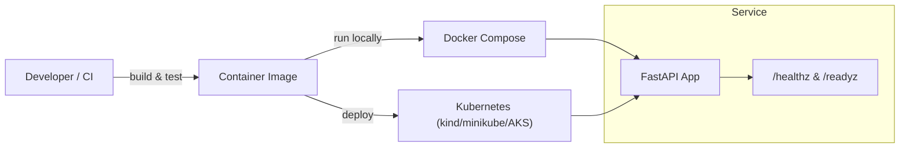

# OrbitOps - DevOps / Platform 

A portfolio-grade **end-to-end DevOps project** demonstrating how to ship and operate a small web service:
**tests → container build → CI → local compose → Kubernetes deployment → smoke checks**.

This repo is designed for **Junior DevOps / Platform** resumes: it focuses on reproducibility, automation,
and production-minded defaults (health checks, non-root container, environment-based config).

---

## What this showcases

- **CI pipeline** (GitHub Actions): lint + tests + container build
- **Docker**: multi-stage build, non-root runtime image
- **Docker Compose**: one-command local run
- **Kubernetes**: manifests with readiness/liveness probes + resource requests/limits
- **Automation scripts**: create a local cluster with **kind**, deploy, and run smoke tests
- **Docs quality**: clear runbooks + architecture diagram

---

## Architecture



---

## Repo structure

```
app/                 # FastAPI service
tests/               # pytest tests
k8s/                 # Kubernetes manifests (base)
scripts/             # kind cluster + deploy + smoke scripts
.github/workflows/   # CI pipeline
docker-compose.yml   # local run
Dockerfile           # container build
Makefile             # convenience commands
```

---

## Quickstart (Local)

### 1) Run with Docker Compose

```bash
docker compose up --build
```

Then open:
- Health: http://localhost:8000/healthz
- Ready:  http://localhost:8000/readyz
- Echo:   http://localhost:8000/api/v1/echo?msg=hello

Stop:
```bash
docker compose down
```

### 2) Run tests locally (no Docker)

```bash
python -m venv .venv
# Windows: .\.venv\Scripts\activate
# macOS/Linux: source .venv/bin/activate
pip install -r requirements.txt
pytest -q
```

---

## Kubernetes (Local) with kind

Prereqs: Docker + kind + kubectl

### One-command flow

```bash
make k8s-up
make k8s-deploy
make k8s-smoke
```

Or manually:

```bash
./scripts/kind_create.sh
kubectl apply -f k8s/base/namespace.yaml
kubectl apply -f k8s/base/
kubectl -n orbitops port-forward svc/orbitops-api 8000:8000
```

---

## CI (GitHub Actions)

The workflow runs on pushes/PRs:
- lint (ruff)
- tests (pytest)
- docker build (validates Dockerfile)

You can optionally extend it to push to GHCR (see comments in `.github/workflows/ci.yml`).

---

## Why this is resume-relevant

This repo proves you can:
- make environments reproducible
- automate checks before deployment
- containerize safely
- deploy to Kubernetes with health probes
- write runbooks that other humans can follow

---

## Roadmap ideas (optional upgrades)

- Add image vulnerability scan step (Trivy)
- Add Kustomize overlays (dev/prod)
- Add Ingress (NGINX) + TLS notes
- Add basic observability (Prometheus scrape + Grafana dashboard)
